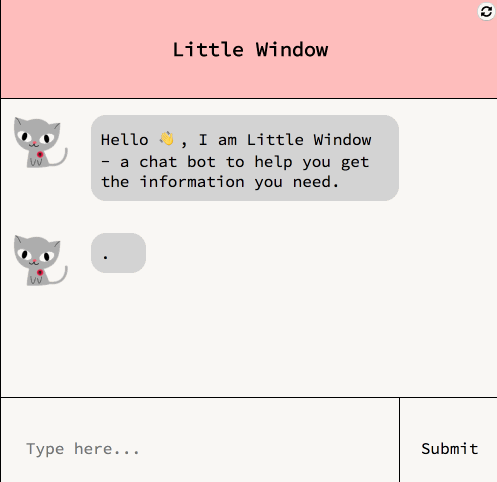
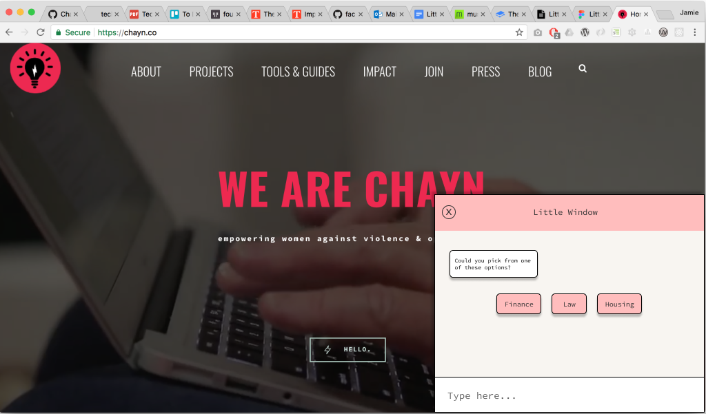
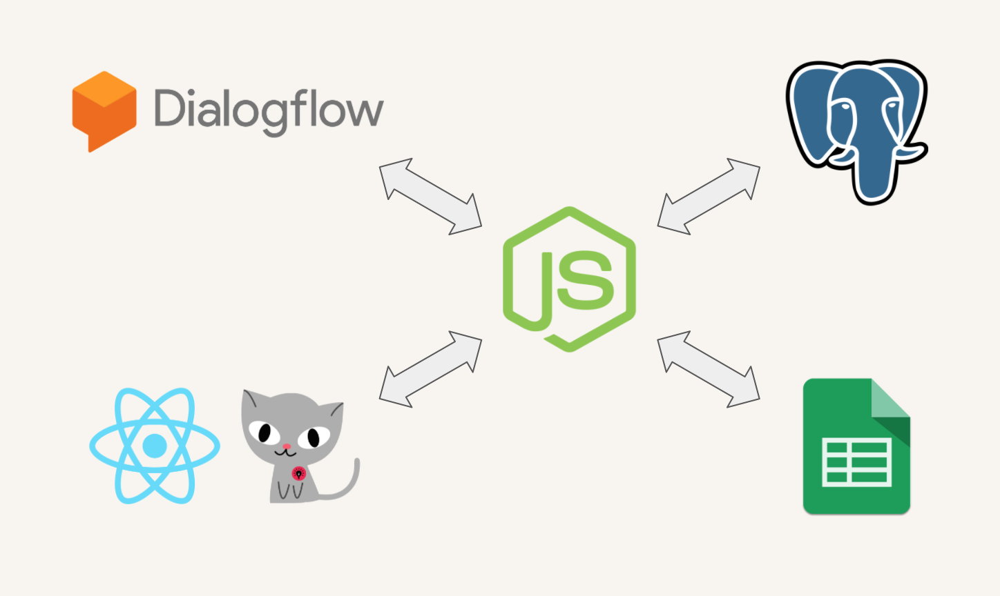
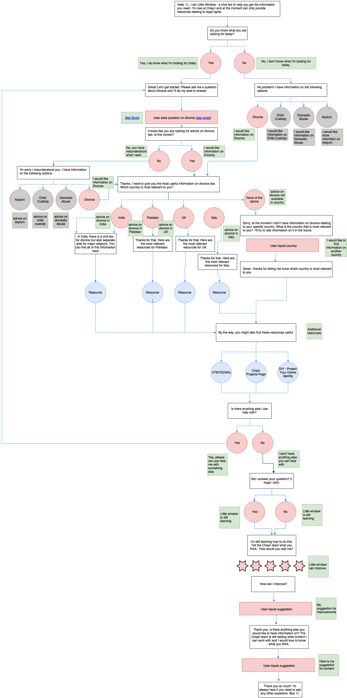

# Little Window

The Little Window app is avaliable [here](https://little-window.herokuapp.com)

## How to run locally
You will need before hand:
- Dialogflow account & key
- Googlesheets API key
- 2 x PostgreSQL Databases

Steps:

1. Clone the repo: 
`git clone https://github.com/fac-12/Little-Window.git`
2. Install dependencies
`npm install`
3. Create a `config.env` in the root directory. This will need:
`DF_KEY = ` [Your Dialogflow client key]  
`DATABASE_URL = ` [Your PostgreSQL prod DB]
`HEROKU_POSTGRESQL_OLIVE_URL = ` [Your PostgreSQL test DB]
`GOOGLE_API_1 = ` https://sheets.googleapis.com/v4/spreadsheets/{your-sheet-id}/values/
`GOOGLE_API_2 = ` ?key={your-GSheet-apikey}
4. Login  to your prod db and run `db_build.sql` 
5. Run the app in dev mode:
`npm run dev`

## Setting up Dialogflow

You can setup your conversation flow in Dialogflow using the following guidelines:
- All intents need to send back a custom payload, even if it's just an empty object
 

 
- For options buttons, send an `options` property in the custom payload. This is an array of objects for each button, where each object contains a `text` and `postback` key & value. `text` is the value that will appear on the button, `postback` is the actual value that will be sent to Dialogflow - this should map to the utterance of next intent you want to trigger with that button.
 

 
- For resources, a `resources` property needs to be added to the payload. This will be a reference for the server to lookup the correct columns in a Google Sheet.
 

 

 

(More info to come on retriggering)

## User Story
‘Direct users quickly and safely to the correct resource so that users can feel informed and empowered to read further.’

 

## Our Solution
> A chat bot to help those who have suffered from domestic abuse to access resources quickkly and safely

#### The aims of the solution:
- To provide information within a 15 minute window
- To provide effective real-time service
- Ensure a safer digital footprint
- To provide accessible and engaging information
- To raise awareness on domestic abuse

___

### The app

___

### What it will look like on the Chayn website

___

### Tech stack
- DialogFlow (Natural Language Processor)
- GoogleSheets API
- React
- Node / Express
- PostgreSQL
- Heroku

___

### Software Architecture
 

___

### Our Conversation Flow
 

